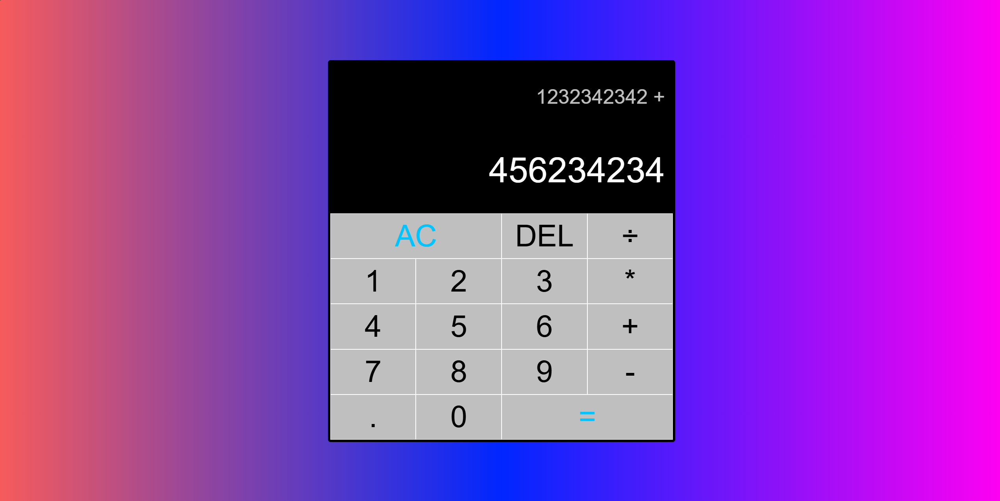

# 🧮 Calculator Web App

## 🚀 Project Overview and Learning Outcomes

This was my first project, where I gained hands-on experience in front-end development. By following a YouTube tutorial, I learned how to use Visual Studio Code and built a solid understanding of how HTML structures a webpage, how CSS customises its appearance, and how JavaScript adds interactivity to improve the user experience.

Through this project, I implemented functionality that allows the calculator to track user inputs and perform mathematical operations. This experience taught me the power of JavaScript in making web applications dynamic, and how essential these technologies are for creating a cohesive, interactive product.

Although this project was a simple introduction to front-end development, it has sparked my curiosity for more complex projects and deeper learning in web development.

---

## ✨ Features

- **➕ Basic Operations:** Easily perform addition, subtraction, multiplication, and division.
- **📱 Clear Display:** View calculations and results clearly on a responsive interface.
- **🎯 User-Friendly:** Designed with simplicity in mind for a smooth user experience.

---

## 🛠️ How to Use

1. **🌐 Access the App:** Open the Calculator Web App in your web browser.
2. **🔢 Input Numbers:** Click on the number buttons to enter your desired numbers.
   - For example, to add 5 and 3, click on `5`, then `+`, and finally `3`.
3. **🟰 Perform Calculation:** Click on the `=` button to see the result. The app will display `5 + 3 = 8`.
4. **🧼 Clear Calculation:** To start a new calculation, use the `C (Clear)` button.

---

### 📊 Example Usage

To calculate `12 - 4`, click: `1`, `2`, `-`, `4`, `=`.  
The display will show: `12 - 4 = 8`.

---

## 📸 Screenshots

---

## 📬 Contact

If you have any questions or feedback, feel free to reach out via [iarham720@gmail.com](mailto:iarham720@gmail.com).
